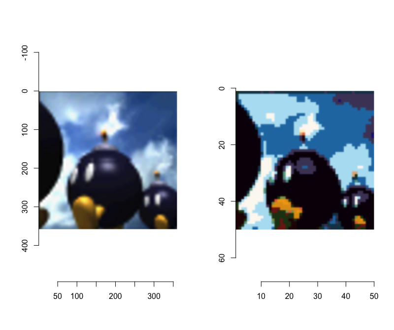
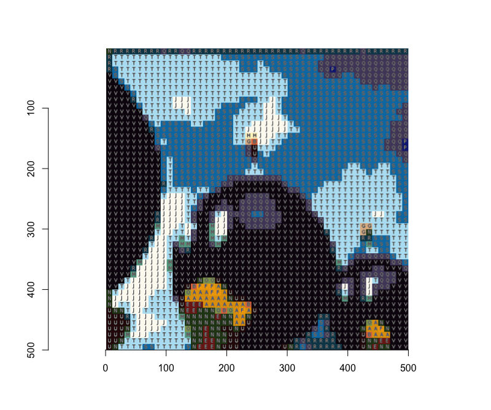

# mosaic
 Create mosaic guide given an input image and the number of tiles

## Script
I wrote this script with the following problem in mind: I wanted to make a mosaic,
for which I thought of using [Idee's tiles](https://www.idee-shop.com/rico-design-tiffany-mosaiksteine-10x10mm-200g); 
but before buying the tiles, I needed to have an idea of how many tiles I would need for each colour.

Luckily there are detailed pictures of each kind of tile on Idee's website, so I could write a script that:

1. Takes in input an image;
2. Divides it in squares of equal dimension (tiles);
3. Fills each tile with the average colour of its content;
4. Finds for each tile the most similar tile from Idee.

## Example

On the left the source image, on the right the image tiled with Idee's tiles:

The script also produces a version where every colour gets a different letter:

Other than providing the number of tiles for each colour:

| Letter      | Count |
| ----------- | ----------- |
| A   | 31          |
| B   | 5        |
| E   | 16        |
| F   | 7        |
| G   | 4        |
| H   | 2        |
| J   | 142        |
| M   | 20        |
| N   | 58        |
| O   | 7        |
| P   | 3        |
| Q   | 213        |
| R   | 81        |
| S   | 561        |
| T   | 526        |
| U   | 42        |
| V   | 782        |